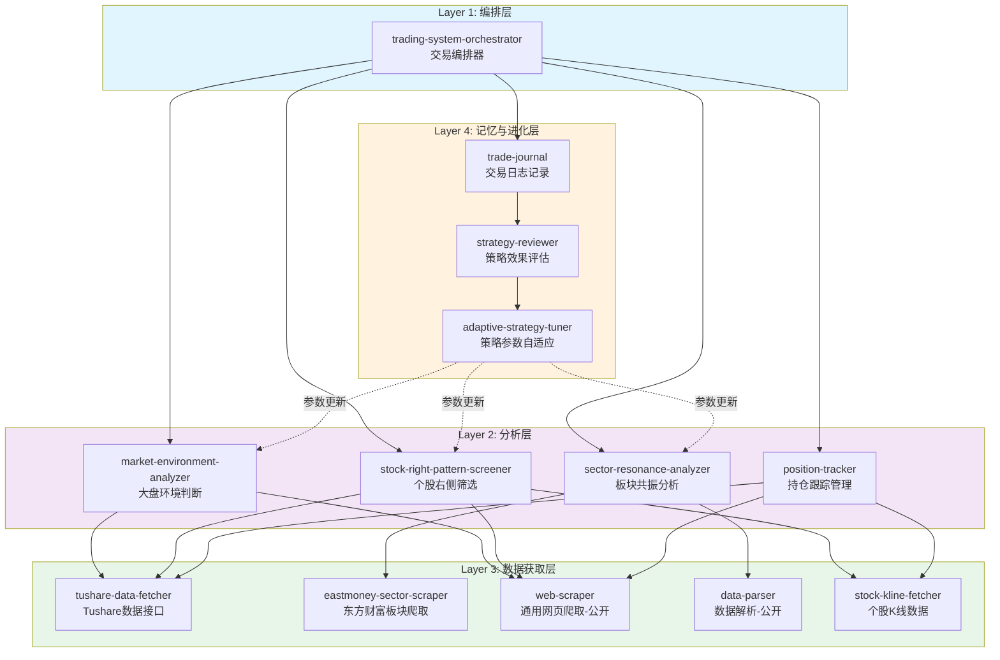
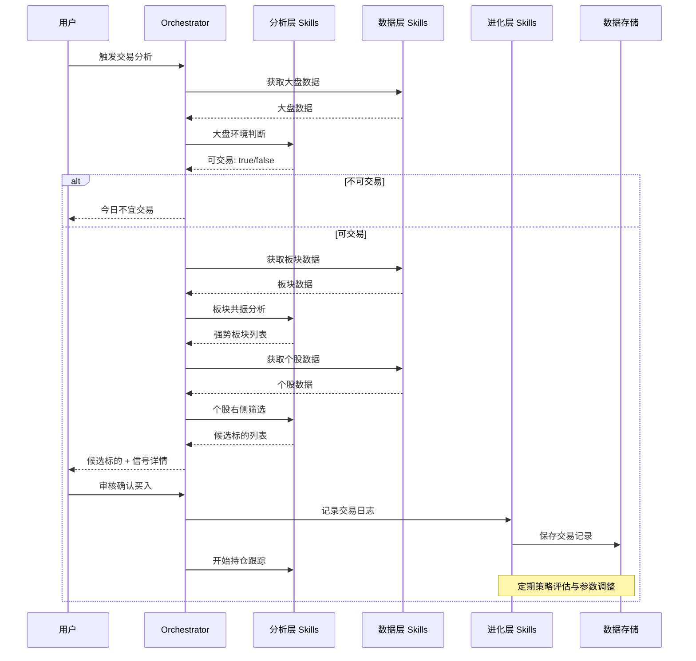

# 个股+板块共振右侧交易系统 - 总体架构设计

## 系统概述

本系统基于 OpenClaw Skill 架构，实现一个完整的"个股+板块共振右侧交易"量化交易系统。系统采用分层设计，从数据获取、信号分析、持仓跟踪到策略自我进化，形成完整的交易闭环。

## 核心设计原则

1. **分层解耦**: 每层 Skill 独立运行，通过标准化 JSON 接口通信
2. **公开 Skill 优先**: 优先复用公开 Skill，减少重复开发
3. **用户审核机制**: 所有交易信号需用户确认后执行
4. **自我进化**: 通过交易日志记录和策略评估，动态适应市场风格切换

## 系统架构图

## 分层说明

| 层级 | 职责 | Skill 类型 |
|------|------|-----------|
| Layer 1 | 编排整个交易流程，协调各层 Skill | 全部自建 |
| Layer 2 | 核心交易逻辑：大盘判断、板块分析、个股筛选、持仓跟踪 | 全部自建 |
| Layer 3 | 数据获取：API 接口、网页爬取、数据解析、K线数据 | 公开 Skill 优先 + 按需自建 |
| Layer 4 | 记忆与进化：交易日志、策略评估、参数自适应 | 全部自建 |

## 数据流总览

## 文档索引

| 文档 | 路径 | 说明 |
|------|------|------|
| 总体架构 | `00-overall-architecture.md` | 本文档 |
| Layer 1 编排层 | `01-layer1-orchestrator.md` | 交易编排器设计 |
| Layer 2 分析层 | `02-layer2-analyzers.md` | 大盘/板块/个股/持仓分析器设计 |
| Layer 3 数据层 | `03-layer3-data-fetchers.md` | 数据获取 Skill 设计 |
| Layer 4 进化层 | `04-layer4-evolution.md` | 交易日志/策略评估/参数自适应设计 |
| 数据格式规范 | `05-data-schema.md` | 统一 JSON Schema 定义 |
| Demo 运行指南 | `06-demo-run-guide.md` | 以半导体板块为例的完整运行流程 |
