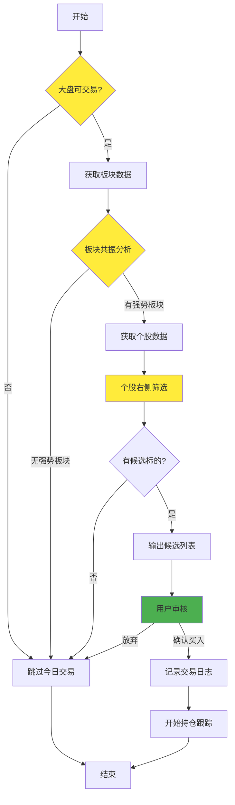
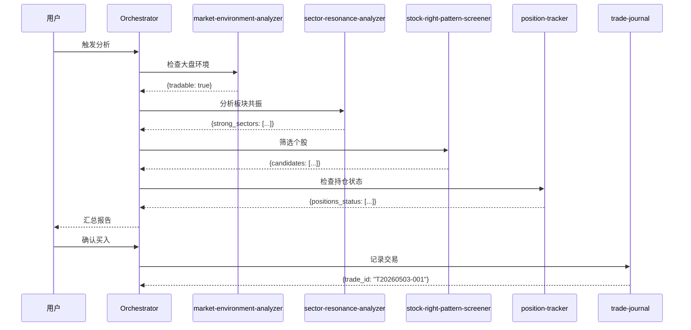

# Layer 1: 编排层设计

## Skill: `trading-system-orchestrator`

### 职责

- 串联整个交易流程
- 协调调用下层 Skill
- 处理异常和边界情况
- 输出最终交易信号报告

### 运行模式



### 输入

```json
{
  "target_sector": "半导体",
  "trade_date": "2026-05-03",
  "mode": "daily_scan"
}
```

### 输出

> Orchestrator 对外输出使用通用响应包装，内部调用各 Skill 时接收裸业务数据。

```json
{
  "timestamp": "2026-05-03T15:00:00Z",
  "market_env": {
    "tradable": true,
    "score": 85,
    "reasons": ["上证站上5日线", "涨停家数≥12", "成交量正常"]
  },
  "strong_sectors": [
    {
      "name": "半导体",
      "score": 92,
      "metrics": {
        "daily_gain": 2.5,
        "gain_5d": 6.8,
        "up_ratio": 0.78,
        "volume_ratio": 1.35
      }
    }
  ],
  "candidates": [
    {
      "code": "688981",
      "name": "中芯国际",
      "pattern": "突破右侧",
      "score": 88,
      "current_price": 45.20,
      "suggested_entry": 45.00,
      "stop_loss": 42.94,
      "take_profit": 48.82,
      "position_size": 0.2
    }
  ],
  "positions_status": [
    {
      "code": "002371",
      "name": "北方华创",
      "current_price": 312.50,
      "pnl_percent": 3.2,
      "action": "hold"
    }
  ]
}
```

### 调用流程



### 异常处理

| 异常场景 | 处理方式 |
|---------|---------|
| 大盘不可交易 | 直接返回，不进行后续分析 |
| 数据获取失败 | 记录错误，跳过该数据源 |
| 无强势板块 | 返回空候选列表 |
| 无候选标的 | 返回空列表，提示用户 |
| 持仓止损触发 | 立即通知用户，建议卖出 |

### 并发与幂等

| 场景 | 处理方式 |
|------|---------|
| 重复触发扫描 | 同一交易日仅执行一次扫描，后续触发返回缓存结果 |
| 重复确认买入 | 同一 trade_id 仅记录一次，幂等处理 |
| 扫描进行中再次触发 | 返回"扫描进行中"状态，不重复执行 |

### 配置参数

```yaml
orchestrator:
  # 运行模式
  mode: "daily_scan"  # daily_scan / real_time / backtest (V2)
  
  # 运行时间
  scan_time: "14:45"  # 尾盘扫描时间
  
  # 定时调度方式
  # - manual: 用户手动触发
  # - cron: 系统定时任务（需宿主环境支持 cron 或等效调度）
  scheduler: "manual"  # manual / cron
  
  # 最大候选数量
  max_candidates: 5
  
  # 同一板块最大持仓数
  max_positions_per_sector: 2
  
  # 总仓位控制
  max_total_position: 0.8
```
