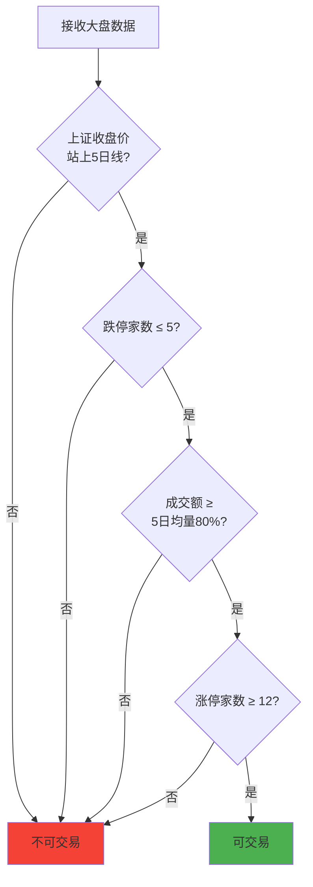
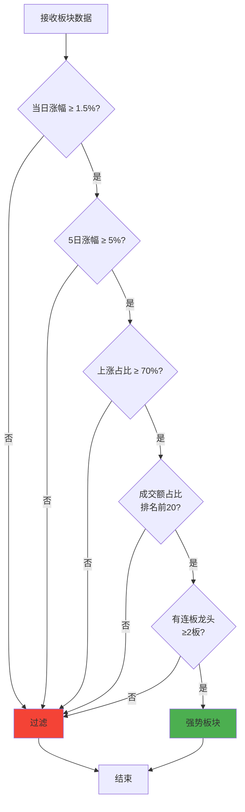
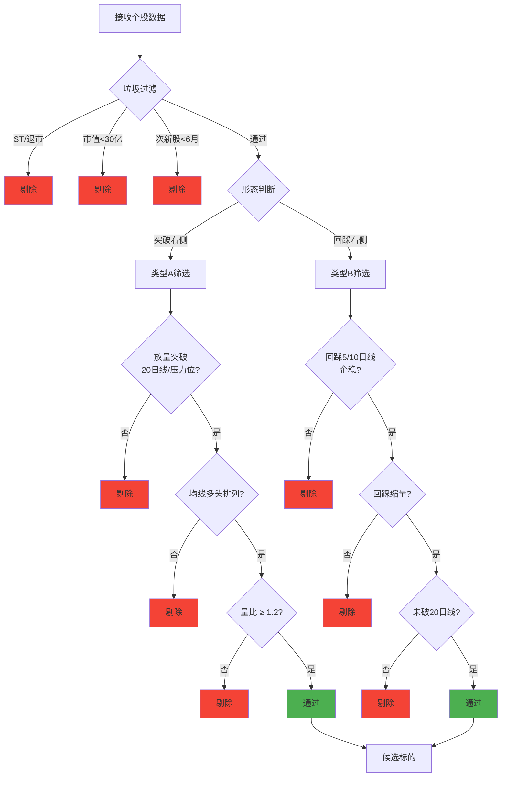
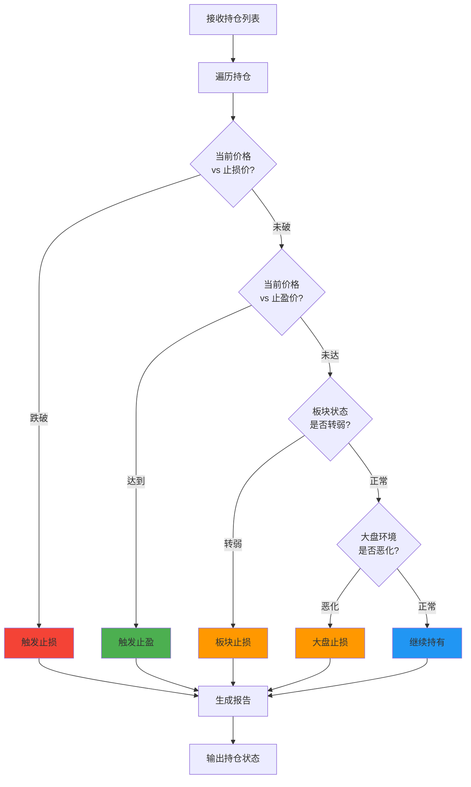

# Layer 2: 分析层设计

## 概述

分析层包含 4 个核心 Skill，负责交易系统的核心逻辑判断：

1. `market-environment-analyzer` - 大盘环境判断
2. `sector-resonance-analyzer` - 板块共振分析
3. `stock-right-pattern-screener` - 个股右侧筛选
4. `position-tracker` - 持仓跟踪管理

---

## Skill 1: `market-environment-analyzer`

### 职责

判断当前大盘环境是否适合交易，过滤熊市、弱市场。

> **格式约定**：以下输入输出示例均为裸业务数据格式（即通用响应中 `data` 字段的内容），详见 `05-data-schema.md`。

### 筛选逻辑流程图



### 输入

> **数据转换约定**：tushare-data-fetcher 以 `stock_daily` + `sector` 方式获取个股数据时，输出格式为 `{ "688981": {...} }`（以 code 为 key 的对象）。Orchestrator 在调用本 Skill 前，需将其转换为 `stocks: [...]` 数组格式。

```json
{
  "index_data": {
    "shanghai": {
      "close": 3250.50,
      "ma5": 3230.20,
      "ma10": 3210.80,
      "ma20": 3180.50
    }
  },
  "market_sentiment": {
    "limit_up_count": 28,
    "limit_down_count": 3,
    "up_count": 3200,
    "down_count": 1500,
    "total_volume": 85000000000
  },
  "volume_5d_avg": 82000000000
}
```

### 输出

```json
{
  "tradable": true,
  "score": 85,
  "checks": {
    "above_ma5": true,
    "limit_down_ok": true,
    "volume_ok": true,
    "limit_up_ok": true
  },
  "details": {
    "limit_up_count": 28,
    "limit_down_count": 3,
    "volume_ratio": 1.04
  }
}
```

### 筛选规则

| 条件 | 阈值 | 说明 |
|------|------|------|
| 上证站上5日线 | close > ma5 | 趋势向上 |
| 跌停家数 | ≤ 5 | 无极端杀跌 |
| 成交额 | ≥ 5日均量80% | 不明显缩量 |
| 涨停家数 | ≥ 12 | 有赚钱效应 |

---

## Skill 2: `sector-resonance-analyzer`

### 职责

分析板块共振强度，识别当日强势主线板块。

### 筛选逻辑流程图



### 输入

```json
{
  "sectors": [
    {
      "name": "半导体",
      "daily_gain": 2.5,
      "gain_3d": 4.2,
      "gain_5d": 6.8,
      "up_ratio": 0.78,
      "limit_up_count": 3,
      "highest_board": 4,
      "volume_ratio": 1.35,
      "volume_market_ratio": 0.08
    }
  ]
}
```

### 输出

```json
{
  "strong_sectors": [
    {
      "name": "半导体",
      "score": 92,
      "checks": {
        "daily_gain_ok": true,
        "gain_5d_ok": true,
        "up_ratio_ok": true,
        "volume_top20": true,
        "has_leader": true
      },
      "metrics": {
        "daily_gain": 2.5,
        "gain_5d": 6.8,
        "up_ratio": 0.78,
        "limit_up_count": 3,
        "highest_board": 4
      }
    }
  ]
}
```

### 筛选规则

| 条件 | 阈值 | 说明 |
|------|------|------|
| 当日涨幅 | ≥ 1.5% | 当日强势 |
| 5日涨幅 | ≥ 5% | 持续强势 |
| 上涨占比 | ≥ 70% | 真共振，非个别股 |
| 成交额占比 | 前20名 | 资金关注度高 |
| 连板龙头 | ≥ 2板 | 有辨识度龙头 |

---

## Skill 3: `stock-right-pattern-screener`

### 职责

在强势板块内筛选右侧形态个股，过滤垃圾标的。

### 筛选逻辑流程图



### 输入

```json
{
  "sector": "半导体",
  "stocks": [
    {
      "code": "688981",
      "name": "中芯国际",
      "close": 45.20,
      "ma5": 44.80,
      "ma10": 44.20,
      "ma20": 43.50,
      "ma60": 42.00,
      "volume_ratio": 1.5,
      "turnover_rate": 3.2,
      "float_mv": 18000000000,
      "is_st": false,
      "is_new": false,
      "pattern": "突破右侧"
    }
  ]
}
```

### 输出

```json
{
  "candidates": [
    {
      "code": "688981",
      "name": "中芯国际",
      "pattern": "突破右侧",
      "score": 88,
      "current_price": 45.20,
      "suggested_entry": 45.00,
      "stop_loss": 42.94,
      "take_profit": 48.82,
      "position_size": 0.2,
      "checks": {
        "not_st": true,
        "float_mv_ok": true,
        "not_new": true,
        "above_ma20": true,
        "ma_alignment": true,
        "volume_ratio_ok": true
      }
    }
  ]
}
```

### 垃圾过滤规则

| 条件 | 规则 | 说明 | 版本 |
|------|------|------|------|
| ST股 | ST、*ST、退市风险 | 剔除 | V1 |
| 流通市值 | < 30亿 | 极小盘杂毛 | V1 |
| 次新股 | 上市 < 6个月 | 波动太大 | V1 |
| 高位股 | 近1月涨幅翻倍 | 高位风险 | V2 |
| 利空公告 | 当日有利空 | 规避 | V2 |

### 右侧形态规则

**类型A：突破右侧**
- 放量突破20日线/前期压力位
- 均线多头排列（5>10>20）
- 量比 ≥ 1.2

**类型B：回踩右侧**
- 回踩5日线或10日线企稳
- 回踩时缩量
- 未跌破20日线

### 板块涨跌幅差异说明

不同板块的涨跌停限制不同，止损止盈参数需相应调整：

| 板块 | 代码前缀 | 涨跌停限制 | 建议短线止损 | 建议短线止盈 |
|------|---------|-----------|------------|------------|
| 主板 | 60xxxx / 00xxxx | ±10% | -5% | +8%~15% |
| 创业板 | 30xxxx | ±20% | -8% | +12%~25% |
| 科创板 | 688xxx | ±20% | -8% | +12%~25% |
| 北交所 | 8xxxxx / 4xxxxx | ±30% | -10% | +15%~30% |

> stock-right-pattern-screener 在输出候选标的时，需根据股票代码前缀自动匹配对应的止损止盈参数。

---

## Skill 4: `position-tracker`

### 职责

持续跟踪用户审核买入的标的，监控止损/止盈信号。

### 跟踪流程图



### 输入

```json
{
  "positions": [
    {
      "code": "688981",
      "name": "中芯国际",
      "sector": "半导体",
      "buy_price": 45.20,
      "buy_date": "2026-05-03",
      "position_size": 0.2,
      "stop_loss": 42.94,
      "take_profit": 48.82
    }
  ],
  "current_prices": {
    "688981": 46.50
  },
  "sector_status": {
    "半导体": {
      "daily_gain": 1.2,
      "limit_up_count": 2
    }
  },
  "market_env": {
    "tradable": true,
    "score": 80
  }
}
```

### 输出

```json
{
  "positions_status": [
    {
      "code": "688981",
      "name": "中芯国际",
      "current_price": 46.50,
      "pnl_percent": 2.87,
      "action": "hold",
      "reason": "板块强势延续，未触及止损止盈"
    }
  ],
  "alerts": []
}
```

### 止损止盈规则

| 类型 | 规则 | 说明 |
|------|------|------|
| 短线止损 | 买入价回撤 -5% | 无条件止损 |
| 趋势止损 | 有效跌破20日线 | 收盘确认 |
| 板块止损 | 主线板块由涨转跌 | 涨停家数大幅退潮 |
| 大盘止损 | 大盘环境恶化 | 不可交易窗口 |
| 短线止盈 | 盈利 8%~15% | 分批止盈（见下文） |
| 趋势止盈 | 板块未走弱+未破均线 | 继续持有 |

### 分批止盈机制

持仓跟踪时，`action` 字段支持以下值：

| action | 含义 | 说明 |
|--------|------|------|
| `hold` | 继续持有 | 未触发任何信号 |
| `partial_sell` | 部分卖出 | 分批止盈时减仓 |
| `sell` | 全部卖出 | 触发止损或全部止盈 |

**分批止盈规则**：

| 盈利阶段 | 动作 | 减仓比例 |
|---------|------|---------|
| 盈利达 8% | 第一次减仓 | 卖出 1/3 仓位 |
| 盈利达 12% | 第二次减仓 | 再卖出 1/3 仓位 |
| 盈利达 15% 或趋势走弱 | 清仓 | 卖出剩余仓位 |

`partial_sell` 时输出示例：

```json
{
  "code": "688981",
  "name": "中芯国际",
  "current_price": 48.82,
  "pnl_percent": 8.49,
  "action": "partial_sell",
  "sell_ratio": 0.33,
  "reason": "盈利达8%，执行第一次分批止盈"
}
```
