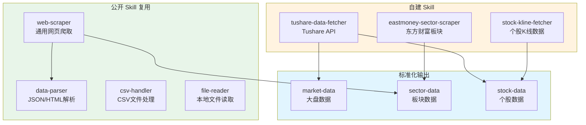
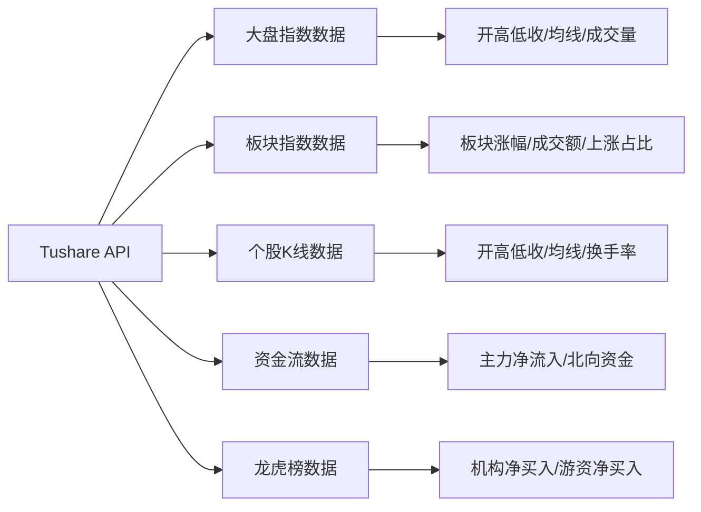
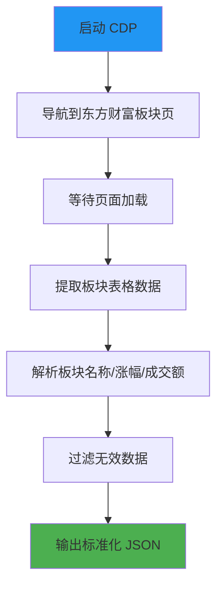
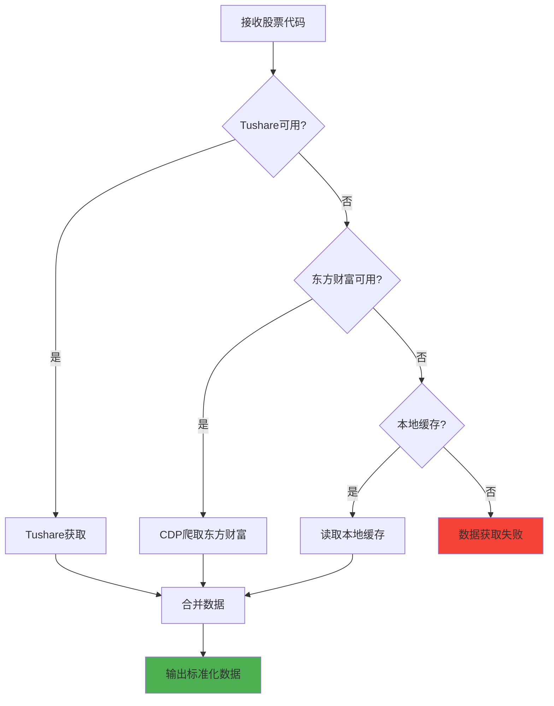
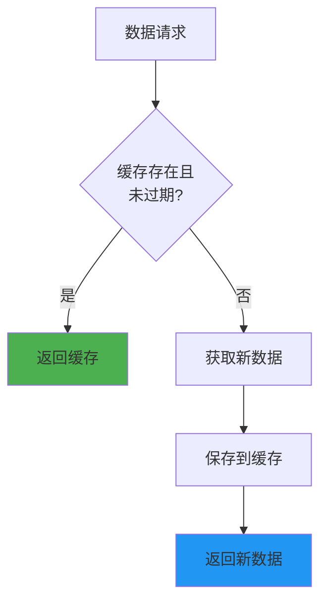

# Layer 3: 数据获取层设计

## 概述

数据获取层负责从各种数据源获取交易数据。优先复用公开 Skill，按需自建专用 Skill。

## 架构设计



---

## 公开 Skill 复用

### 1. `web-scraper`

**用途**: 通用网页爬取，CDP 驱动

**输入**:
```json
{
  "url": "https://quote.eastmoney.com/center/boardList.html",
  "selector": "table.board-table",
  "wait_for": "table"
}
```

**输出**: HTML 内容或结构化数据

### 2. `data-parser`

**用途**: JSON/HTML 数据解析

**输入**:
```json
{
  "format": "html",
  "content": "<table>...</table>",
  "rules": {
    "columns": ["name", "code", "gain", "volume"]
  }
}
```

**输出**: 结构化 JSON 数据

### 3. `csv-handler`

**用途**: CSV 文件读写处理

**输入**:
```json
{
  "action": "read",
  "file_path": "data/sector_2026-05-03.csv"
}
```

**输出**: JSON 数组

### 4. `file-reader`

**用途**: 本地文件读取

**输入**:
```json
{
  "file_path": "config/trading_params.yaml"
}
```

**输出**: 文件内容

---

## 自建 Skill

### Skill 1: `tushare-data-fetcher`

#### 职责

通过 Tushare API 获取标准化量化数据。

#### 数据获取范围



#### 输入

```json
{
  "data_type": "daily",
  "ts_code": "000001.SH",
  "start_date": "2026-04-01",
  "end_date": "2026-05-03",
  "fields": ["open", "high", "low", "close", "vol", "amount"]
}
```

#### `data_type` 枚举定义

| data_type | 说明 | 必填字段 | 可选字段 |
|-----------|------|---------|---------|
| `index_daily` | 大盘指数日线 | `ts_code`, `start_date`, `end_date` | `fields` |
| `index_sentiment` | 市场情绪数据 | `trade_date` | - |
| `sector_daily` | 板块日线数据 | `sector`, `start_date`, `end_date` | `fields` |
| `stock_daily` | 个股日线数据 | `ts_code` 或 `sector`, `start_date`, `end_date` | `fields` |
| `money_flow` | 资金流数据 | `ts_code`, `start_date`, `end_date` | - |
| `top_list` | 龙虎榜数据 | `trade_date` | - |

> 当 `data_type` 为 `stock_daily` 时，可传入 `sector` 替代 `ts_code`，表示获取该板块所有成分股数据。

#### 输出

> 本 Skill 提供板块基础数据（涨幅、成交额、涨跌家数等），均线和资金流数据需由 tushare-data-fetcher 补充。

```json
{
  "status": "success",
  "data": [
    {
      "trade_date": "2026-05-03",
      "open": 3240.00,
      "high": 3260.50,
      "low": 3235.20,
      "close": 3250.50,
      "volume": 285000000,
      "amount": 38500000000
    }
  ]
}
```

#### 配置

```yaml
tushare:
  token: "${TUSHARE_TOKEN}"
  rate_limit: 200  # 每分钟调用次数限制
  retry_times: 3
```

---

### Skill 2: `eastmoney-sector-scraper`

#### 职责

通过 CDP 爬取东方财富板块数据，补充 API 没有的板块情绪数据。

#### 爬取流程图



#### 输入

```json
{
  "sector_type": "industry",
  "date": "2026-05-03",
  "fields": ["name", "code", "gain", "gain_5d", "volume", "up_count", "down_count"]
}
```

#### 输出

```json
{
  "status": "success",
  "data": [
    {
      "name": "半导体",
      "code": "BK0921",
      "gain": 2.5,
      "gain_5d": 6.8,
      "volume": 8500000000,
      "up_count": 78,
      "down_count": 22,
      "limit_up_count": 3,
      "highest_board": 4
    }
  ]
}
```

#### 数据源 URL

| 数据类型 | URL |
|---------|-----|
| 行业板块 | https://quote.eastmoney.com/center/boardList.html#hy_board |
| 概念板块 | https://quote.eastmoney.com/center/boardList.html#gain_board |

---

### Skill 3: `stock-kline-fetcher`

#### 职责

获取个股 K 线数据，支持多种数据源。

#### 数据获取策略



#### 输入

```json
{
  "stock_codes": ["688981", "002371"],
  "start_date": "2026-04-01",
  "end_date": "2026-05-03",
  "fields": ["open", "high", "low", "close", "volume", "amount", "turnover_rate"]
}
```

#### 输出

```json
{
  "status": "success",
  "data": {
    "688981": [
      {
        "trade_date": "2026-05-03",
        "open": 44.80,
        "high": 45.50,
        "low": 44.60,
        "close": 45.20,
        "volume": 85000000,
        "amount": 3850000000,
        "turnover_rate": 3.2
      }
    ]
  }
}
```

---

## 数据缓存策略



### 缓存规则

| 数据类型 | 盘后缓存时间 | 盘中缓存时间 | 说明 |
|---------|------------|------------|------|
| 大盘数据 | 当日有效（至次日开盘前） | 5 分钟 | 盘中数据持续变化 |
| 板块数据 | 当日有效 | 5 分钟 | 盘中数据持续变化 |
| 个股数据 | 当日有效 | 3 分钟 | 盘中价格实时变动 |
| 历史数据 | 永久 | 永久 | 不变化 |

> **判断盘中/盘后**：以 A 股交易时间（9:30-11:30, 13:00-15:00）为准。交易时间内使用盘中缓存策略，其余时间使用盘后缓存策略。
