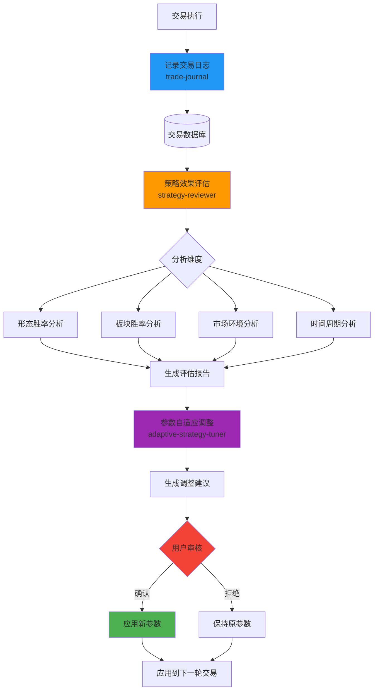
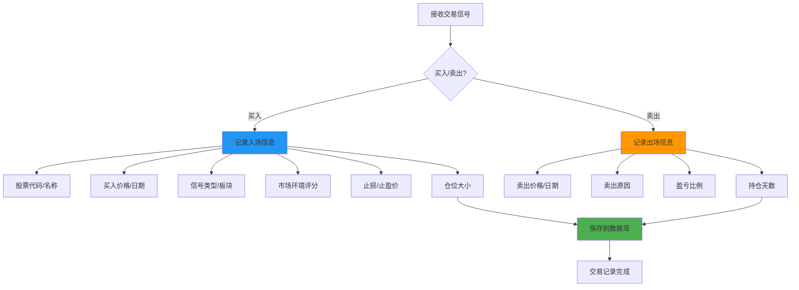
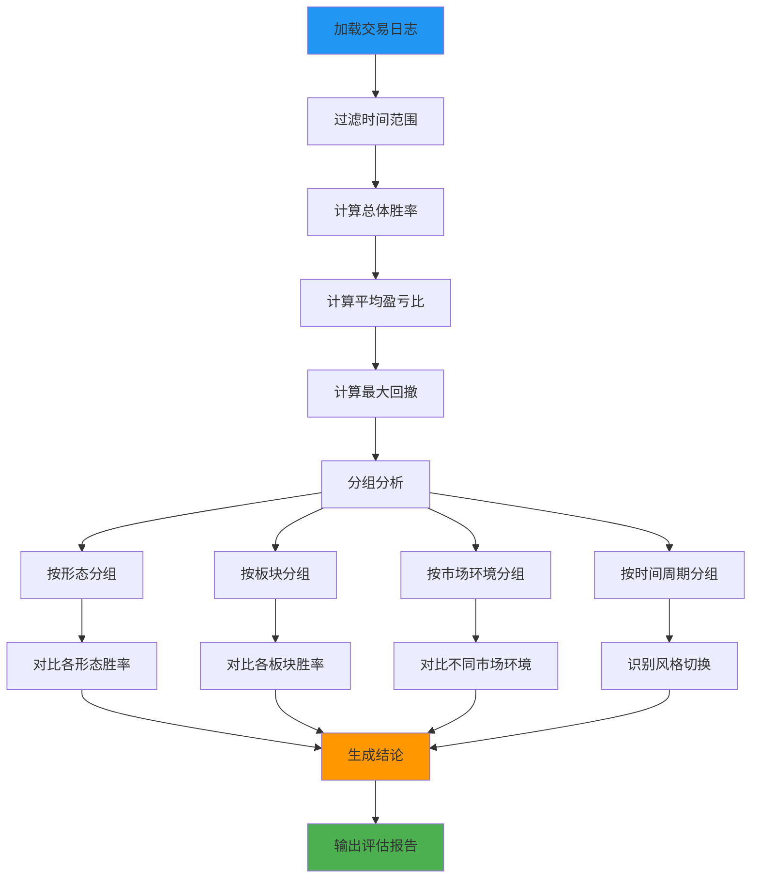
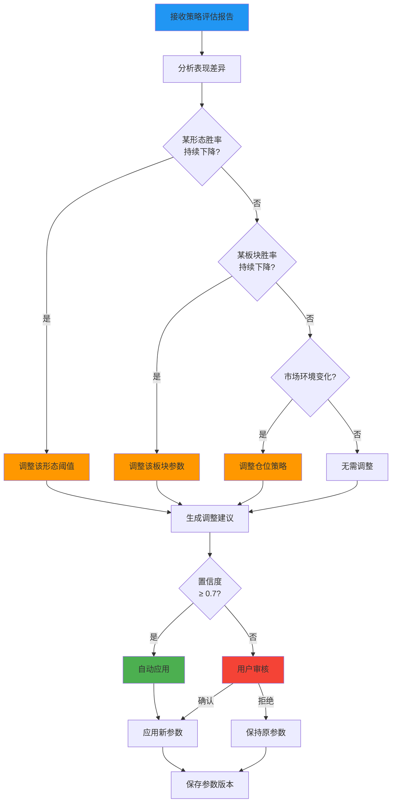

# Layer 4: 记忆与进化层设计

## 概述

记忆与进化层赋予系统自我学习和动态适应市场风格的能力，包含 3 个核心 Skill：

1. `trade-journal` - 交易日志记录
2. `strategy-reviewer` - 策略效果评估
3. `adaptive-strategy-tuner` - 策略参数自适应调整

## 自我进化流程图



---

## Skill 1: `trade-journal`

### 职责

记录每笔交易的完整信息，结构化存储供后续分析。

### 数据记录流程图



### 输入

> **trade_id 生成规则**：由 Orchestrator 在用户确认买入时生成，格式为 `T{yyyyMMdd}-{seq}`（如 `T20260503-001`），同一天内序号自增。trade-journal 仅负责存储，不负责生成。

```json
{
  "action": "entry",
  "trade_id": "T20260503-001",
  "code": "688981",
  "name": "中芯国际",
  "buy_price": 45.20,
  "buy_date": "2026-05-03",
  "pattern": "突破右侧",
  "sector": "半导体",
  "market_env_score": 85,
  "sector_score": 92,
  "stop_loss": 42.94,
  "take_profit": 48.82,
  "position_size": 0.2
}
```

### 输出

```json
{
  "status": "success",
  "trade_id": "T20260503-001",
  "message": "交易记录已保存"
}
```

### 数据存储结构

```json
{
  "trades": [
    {
      "trade_id": "T20260503-001",
      "entry": {
        "code": "688981",
        "name": "中芯国际",
        "price": 45.20,
        "date": "2026-05-03",
        "pattern": "突破右侧",
        "sector": "半导体",
        "market_env_score": 85,
        "sector_score": 92,
        "stop_loss": 42.94,
        "take_profit": 48.82,
        "position_size": 0.2
      },
      "exit": {
        "price": 48.50,
        "date": "2026-05-08",
        "reason": "止盈",
        "pnl_percent": 7.30,
        "holding_days": 5
      },
      "outcome": "win",
      "tags": ["半导体", "突破右侧", "强势板块"]
    }
  ]
}
```

---

## Skill 2: `strategy-reviewer`

### 职责

定期分析交易日志，统计各策略类型的胜率、盈亏比，识别有效和失效信号。

### 评估流程图



### 输入

```json
{
  "start_date": "2026-04-01",
  "end_date": "2026-05-01",
  "analysis_type": "weekly"
}
```

### 输出

```json
{
  "period": "2026-04-01 ~ 2026-05-01",
  "summary": {
    "total_trades": 28,
    "win_trades": 18,
    "loss_trades": 10,
    "win_rate": 0.64,
    "avg_pnl_win": 8.5,
    "avg_pnl_loss": -4.2,
    "profit_loss_ratio": 2.02,
    "max_drawdown": -12.5
  },
  "pattern_analysis": {
    "突破右侧": {
      "trades": 15,
      "win_rate": 0.73,
      "avg_pnl": 6.8,
      "avg_holding_days": 5.2
    },
    "回踩右侧": {
      "trades": 13,
      "win_rate": 0.54,
      "avg_pnl": 3.2,
      "avg_holding_days": 7.1
    }
  },
  "sector_analysis": {
    "半导体": {
      "trades": 8,
      "win_rate": 0.75,
      "avg_pnl": 7.2
    },
    "新能源": {
      "trades": 6,
      "win_rate": 0.33,
      "avg_pnl": -1.5
    }
  },
  "market_env_analysis": {
    "high_score_80_100": {
      "trades": 12,
      "win_rate": 0.75
    },
    "mid_score_60_80": {
      "trades": 10,
      "win_rate": 0.60
    },
    "low_score_below_60": {
      "trades": 6,
      "win_rate": 0.33
    }
  },
  "conclusion": "突破右侧策略在半导体板块表现优异，新能源板块需调整参数。大盘环境评分与胜率正相关，建议只在高分环境交易。",
  "suggestions": [
    "提高新能源板块筛选阈值",
    "大盘评分低于60时减少仓位",
    "突破右侧策略可适当提高仓位"
  ]
}
```

### 评估维度

| 维度 | 分析内容 | 输出 |
|------|---------|------|
| 形态胜率 | 各右侧形态的胜率对比 | 最优形态推荐 |
| 板块胜率 | 各板块的交易胜率对比 | 优势板块识别 |
| 市场环境 | 不同大盘环境下的胜率 | 最佳交易窗口 |
| 时间周期 | 不同时间段的胜率变化 | 市场风格切换识别 |
| 持仓天数 | 平均持仓天数与盈亏关系 | 最佳持有期 |
| 仓位大小 | 不同仓位下的盈亏分布 | 最优仓位配置 |

---

## Skill 3: `adaptive-strategy-tuner`

### 职责

根据策略评估结果，动态调整筛选参数，适应市场风格切换。

### 自适应调整流程图



### 输入

```json
{
  "strategy_review": {
    "pattern_analysis": {
      "突破右侧": {"win_rate": 0.73},
      "回踩右侧": {"win_rate": 0.54}
    },
    "sector_analysis": {
      "半导体": {"win_rate": 0.75},
      "新能源": {"win_rate": 0.33}
    }
  },
  "current_params": {
    "sector_min_daily_gain": 1.5,
    "sector_min_5d_gain": 5.0,
    "sector_min_up_ratio": 0.70,
    "stock_min_volume_ratio": 1.2,
    "stop_loss_percent": 5.0,
    "take_profit_percent": 10.0
  }
}
```

### 输出

```json
{
  "suggested_params": {
    "sector_min_daily_gain": 1.5,
    "sector_min_5d_gain": 4.0,
    "sector_min_up_ratio": 0.70,
    "stock_min_volume_ratio": 1.5,
    "stop_loss_percent": 5.0,
    "take_profit_percent": 12.0
  },
  "changes": [
    {
      "param": "sector_min_5d_gain",
      "old_value": 5.0,
      "new_value": 4.0,
      "reason": "近期市场风格偏向稳健，降低阈值可提高信号覆盖率"
    },
    {
      "param": "stock_min_volume_ratio",
      "old_value": 1.2,
      "new_value": 1.5,
      "reason": "提高量比阈值可过滤虚假突破"
    },
    {
      "param": "take_profit_percent",
      "old_value": 10.0,
      "new_value": 12.0,
      "reason": "突破右侧策略平均盈利6.8%，可提高止盈目标"
    }
  ],
  "confidence": 0.78,
  "auto_apply": false
}
```

### 参数调整规则

| 触发条件 | 调整动作 | 说明 |
|---------|---------|------|
| 某形态胜率 < 50% 连续2周 | 提高该形态筛选阈值 | 过滤低质量信号 |
| 某形态胜率 > 70% 连续2周 | 降低该形态筛选阈值 | 提高信号覆盖率 |
| 某板块胜率 < 40% | 提高该板块阈值或暂停 | 规避弱势板块 |
| 大盘高分胜率 > 75% | 提高高分时仓位 | 把握确定性机会 |
| 平均持仓天数增加 | 调整止盈目标 | 适应市场节奏 |
| 最大回撤 > 15% | 降低总仓位 | 控制风险 |

### 置信度计算方法

置信度决定参数调整建议是自动应用还是需用户审核。计算公式：

```
confidence = w1 × sample_score + w2 × trend_score + w3 × consistency_score

其中：
- sample_score = min(sample_size / min_sample, 1.0)
  - sample_size: 该分析维度下的交易样本数
  - min_sample: 最小有效样本数（默认 20）
  
- trend_score = |win_rate_change| / 0.15
  - win_rate_change: 胜率变化幅度（如从 0.65 降到 0.50，变化为 -0.15）
  - 变化幅度越大，置信度越高（趋势越明显）

- consistency_score = consistent_weeks / 4
  - consistent_weeks: 胜率持续同方向变化的周数
  - 持续时间越长，置信度越高

- 权重：w1=0.3, w2=0.4, w3=0.3

- 阈值：confidence ≥ 0.7 时自动应用，否则需用户审核
```

**示例**：半导体板块近 3 周胜率从 0.75 降到 0.55，共 8 笔交易：
- sample_score = min(8/20, 1.0) = 0.40
- trend_score = |−0.20| / 0.15 = 1.33 → clamp to 1.0
- consistency_score = 3/4 = 0.75
- confidence = 0.3×0.40 + 0.4×1.0 + 0.3×0.75 = 0.12 + 0.40 + 0.225 = **0.745** → 自动应用

### 参数版本管理

```json
{
  "params_history": [
    {
      "version": "v1.0",
      "date": "2026-05-01",
      "params": {...},
      "reason": "初始参数",
      "performance": {
        "win_rate": 0.64,
        "avg_pnl": 5.2
      }
    },
    {
      "version": "v1.1",
      "date": "2026-05-08",
      "params": {...},
      "reason": "降低板块5日涨幅阈值",
      "performance": {
        "win_rate": 0.68,
        "avg_pnl": 5.8
      }
    }
  ]
}
```
