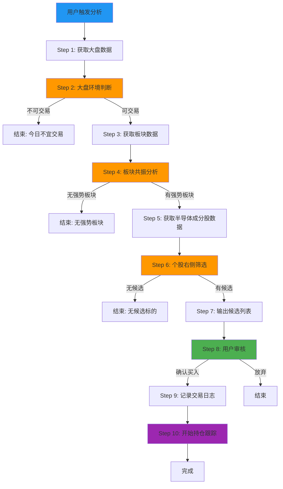

# Demo 运行指南 - 半导体板块示例

## 概述

本文档以"半导体"板块为例，演示完整的交易信号生成流程。

## 前置条件

1. 已安装并配置所有相关 Skill
2. 已配置 Tushare API Token
3. 已配置 CDP 浏览器环境
4. 已初始化交易参数

## 完整运行流程



---

## Step 1: 获取大盘数据

### 调用 Skill: `tushare-data-fetcher`

**输入**:
```json
{
  "data_type": "index_daily",
  "ts_code": "000001.SH",
  "start_date": "2026-04-26",
  "end_date": "2026-05-03"
}
```

**输出**:
```json
{
  "status": "success",
  "data": [
    {
      "trade_date": "2026-05-03",
      "open": 3240.00,
      "high": 3260.50,
      "low": 3235.20,
      "close": 3250.50,
      "volume": 285000000,
      "amount": 38500000000
    }
  ]
}
```

### 调用 Skill: `tushare-data-fetcher` (市场情绪)

**输入**:
```json
{
  "data_type": "index_sentiment",
  "trade_date": "2026-05-03"
}
```

**输出**:
```json
{
  "status": "success",
  "data": {
    "limit_up_count": 28,
    "limit_down_count": 3,
    "up_count": 3200,
    "down_count": 1500,
    "total_amount": 95000000000
  }
}
```

---

## Step 2: 大盘环境判断

### 调用 Skill: `market-environment-analyzer`

**输入**: (Step 1 输出的大盘数据)

**处理逻辑**:
| 条件 | 实际值 | 阈值 | 结果 |
|------|--------|------|------|
| 上证站上5日线 | 3250.50 > 3230.20 | close > ma5 | ✅ 通过 |
| 跌停家数 | 3 | ≤ 5 | ✅ 通过 |
| 成交额 | 950亿 vs 5日均量920亿 | ≥ 80% | ✅ 通过 |
| 涨停家数 | 28 | ≥ 12 | ✅ 通过 |

**输出**:
```json
{
  "status": "success",
  "data": {
    "tradable": true,
    "score": 85,
    "checks": {
      "above_ma5": true,
      "limit_down_ok": true,
      "volume_ok": true,
      "limit_up_ok": true
    }
  }
}
```

**结论**: 今日可交易 ✅

---

## Step 3: 获取板块数据

### 调用 Skill: `eastmoney-sector-scraper`

**输入**:
```json
{
  "sector_type": "industry",
  "date": "2026-05-03"
}
```

**输出** (部分):
```json
{
  "status": "success",
  "data": [
    {
      "name": "半导体",
      "code": "BK0921",
      "gain": 2.5,
      "gain_5d": 6.8,
      "up_ratio": 0.78,
      "limit_up_count": 3,
      "highest_board": 4,
      "volume_market_ratio": 0.08
    },
    {
      "name": "新能源",
      "code": "BK0918",
      "gain": 0.8,
      "gain_5d": 2.1,
      "up_ratio": 0.55,
      "limit_up_count": 1,
      "highest_board": 2,
      "volume_market_ratio": 0.05
    }
  ]
}
```

---

## Step 4: 板块共振分析

### 调用 Skill: `sector-resonance-analyzer`

**输入**: (Step 3 输出的板块数据)

**处理逻辑** (以半导体为例):
| 条件 | 实际值 | 阈值 | 结果 |
|------|--------|------|------|
| 当日涨幅 | 2.5% | ≥ 1.5% | ✅ 通过 |
| 5日涨幅 | 6.8% | ≥ 5% | ✅ 通过 |
| 上涨占比 | 78% | ≥ 70% | ✅ 通过 |
| 成交额占比 | 前15名 | 前20名 | ✅ 通过 |
| 连板龙头 | 4板 | ≥ 2板 | ✅ 通过 |

**输出**:
```json
{
  "status": "success",
  "data": {
    "strong_sectors": [
      {
        "name": "半导体",
        "score": 92,
        "checks": {
          "daily_gain_ok": true,
          "gain_5d_ok": true,
          "up_ratio_ok": true,
          "volume_top20": true,
          "has_leader": true
        }
      }
    ]
  }
}
```

**结论**: 半导体板块为强势共振板块 ✅

---

## Step 5: 获取半导体成分股数据

### 调用 Skill: `tushare-data-fetcher`

**输入**:
```json
{
  "data_type": "stock_daily",
  "sector": "半导体",
  "start_date": "2026-04-26",
  "end_date": "2026-05-03"
}
```

**输出** (部分):
```json
{
  "status": "success",
  "data": {
    "688981": {
      "code": "688981",
      "name": "中芯国际",
      "close": 45.20,
      "ma5": 44.80,
      "ma10": 44.20,
      "ma20": 43.50,
      "volume_ratio": 1.5,
      "turnover_rate": 3.2,
      "float_mv": 18000000000,
      "is_st": false,
      "is_new": false
    },
    "002371": {
      "code": "002371",
      "name": "北方华创",
      "close": 312.50,
      "ma5": 310.20,
      "ma10": 305.80,
      "ma20": 298.50,
      "volume_ratio": 1.3,
      "turnover_rate": 2.8,
      "float_mv": 150000000000,
      "is_st": false,
      "is_new": false
    }
  }
}
```

---

## Step 6: 个股右侧筛选

### 调用 Skill: `stock-right-pattern-screener`

**输入**: (Step 5 输出的个股数据 + 半导体板块信息)

**处理逻辑** (以中芯国际为例):

**垃圾过滤**:
| 条件 | 实际值 | 规则 | 结果 |
|------|--------|------|------|
| ST | false | 非ST | ✅ 通过 |
| 流通市值 | 180亿 | ≥ 30亿 | ✅ 通过 |
| 次新股 | false | 非次新 | ✅ 通过 |

**形态判断** (突破右侧):
| 条件 | 实际值 | 规则 | 结果 |
|------|--------|------|------|
| 突破20日线 | 45.20 > 43.50 | close > ma20 | ✅ 通过 |
| 均线多头 | 5>10>20 | ma5>ma10>ma20 | ✅ 通过 |
| 量比 | 1.5 | ≥ 1.2 | ✅ 通过 |

**输出**:
```json
{
  "status": "success",
  "data": {
    "candidates": [
      {
        "code": "688981",
        "name": "中芯国际",
        "pattern": "突破右侧",
        "score": 88,
        "current_price": 45.20,
        "suggested_entry": 45.00,
        "stop_loss": 42.94,
        "take_profit": 48.82,
        "position_size": 0.2
      },
      {
        "code": "002371",
        "name": "北方华创",
        "pattern": "回踩右侧",
        "score": 82,
        "current_price": 312.50,
        "suggested_entry": 310.00,
        "stop_loss": 295.50,
        "take_profit": 335.00,
        "position_size": 0.2
      }
    ]
  }
}
```

---

## Step 7: 输出候选列表

### Orchestrator 汇总输出

```json
{
  "timestamp": "2026-05-03T14:45:00Z",
  "market_env": {
    "tradable": true,
    "score": 85
  },
  "strong_sectors": [
    {
      "name": "半导体",
      "score": 92
    }
  ],
  "candidates": [
    {
      "code": "688981",
      "name": "中芯国际",
      "pattern": "突破右侧",
      "score": 88,
      "suggested_entry": 45.00,
      "stop_loss": 42.94,
      "take_profit": 48.82,
      "position_size": 0.2
    },
    {
      "code": "002371",
      "name": "北方华创",
      "pattern": "回踩右侧",
      "score": 82,
      "suggested_entry": 310.00,
      "stop_loss": 295.50,
      "take_profit": 335.00,
      "position_size": 0.2
    }
  ]
}
```

---

## Step 8: 用户审核

用户查看候选列表后，决定：
- ✅ 买入 中芯国际 (688981)
- ❌ 放弃 北方华创 (002371)

---

## Step 9: 记录交易日志

### 调用 Skill: `trade-journal`

**输入**:
```json
{
  "action": "entry",
  "trade_id": "T20260503-001",
  "code": "688981",
  "name": "中芯国际",
  "buy_price": 45.00,
  "buy_date": "2026-05-03",
  "pattern": "突破右侧",
  "sector": "半导体",
  "market_env_score": 85,
  "sector_score": 92,
  "stop_loss": 42.75,
  "take_profit": 49.50,
  "position_size": 0.2
}
```

---

## Step 10: 开始持仓跟踪

### 调用 Skill: `position-tracker`

**每日自动运行**:
```json
{
  "positions": [
    {
      "code": "688981",
      "buy_price": 45.00,
      "stop_loss": 42.75,
      "take_profit": 49.50
    }
  ]
}
```

**输出** (示例):
```json
{
  "positions_status": [
    {
      "code": "688981",
      "current_price": 46.50,
      "pnl_percent": 3.33,
      "action": "hold",
      "reason": "板块强势延续，未触及止损止盈"
    }
  ]
}
```

---

## 完整流程总结

| 步骤 | Skill | 结果 | 耗时 |
|------|-------|------|------|
| 1. 获取大盘数据 | tushare-data-fetcher | 成功 | ~2s |
| 2. 大盘环境判断 | market-environment-analyzer | 可交易 | ~0.5s |
| 3. 获取板块数据 | eastmoney-sector-scraper | 成功 | ~5s |
| 4. 板块共振分析 | sector-resonance-analyzer | 半导体强势 | ~0.5s |
| 5. 获取个股数据 | tushare-data-fetcher | 成功 | ~3s |
| 6. 个股右侧筛选 | stock-right-pattern-screener | 2只候选 | ~0.5s |
| 7. 输出候选列表 | orchestrator | 汇总报告 | ~0.2s |
| 8. 用户审核 | 人工 | 确认买入 | - |
| 9. 记录交易日志 | trade-journal | 成功 | ~0.2s |
| 10. 开始持仓跟踪 | position-tracker | 持续监控 | - |

**总耗时**: ~12秒 (不含用户审核时间)

---

## 异常场景示例

### 场景 A：大盘不可交易

**Step 2 输出**:
```json
{
  "tradable": false,
  "score": 35,
  "checks": {
    "above_ma5": false,
    "limit_down_ok": false,
    "volume_ok": true,
    "limit_up_ok": false
  },
  "details": {
    "limit_up_count": 5,
    "limit_down_count": 18,
    "volume_ratio": 0.65
  }
}
```

**Orchestrator 输出**:
```json
{
  "timestamp": "2026-05-03T14:45:00Z",
  "market_env": {
    "tradable": false,
    "score": 35,
    "reasons": ["上证未站上5日线", "跌停家数18>5", "涨停家数5<12", "成交额仅为5日均量65%"]
  },
  "strong_sectors": [],
  "candidates": [],
  "positions_status": []
}
```

**结论**: 今日不宜交易，流程终止。

---

### 场景 B：数据获取失败

**Step 1 输出** (Tushare API 超限):
```json
{
  "status": "error",
  "skill_name": "tushare-data-fetcher",
  "error": {
    "code": "API_RATE_LIMIT",
    "message": "API 调用频率超限",
    "retry_after": 60
  }
}
```

**Orchestrator 处理**: 回退到 `stock-kline-fetcher` 使用东方财富 CDP 爬取数据，若仍失败则返回错误提示用户稍后重试。
